# Техническое задание

## Система управления интернет-библиотеки с переводами книг

### Введение

Целью проекта является разработка интернет-библиотеки с переводами книг, которая обеспечит
удобный поиск переводов зарубежных книг и удобное чтение книги.

Интернет-библиотека с переводами книг имеет пользователей, которые могут как читать, так
и публиковать переводы книг. Основные задачи библиотеки: хранить переводы глав книг,
обеспечить удобное чтение и поиск переводов.

### Функциональные требования

Пользователь может
1. Саморегестрироваться/редактировать самого себя/удалять самого себя
2. Искать и читать книги
3. Публиковать переводы книг
4. Комментировать книгу
5. Продолжать читать с той главы, на которой остановился (хранения сессии чтения)
6. Помечать книгу одной из категорий ("Читаю", "В планах", "Отложено", "Прочитано", "Брошено", "Любимое")
7. Создавать/редактировать/удалять автора и добавлять его к книгам и наоборот
8. Создать книгу и отправить запос на её публикацию администратору
9. Создать жанры и разместить книги по ним
10. Создать авторов и назначить книгам их

#### Саморегистрация

Пользователь самостоятельно регистриуется в системе. После чего может редактировать свой профиль или удалить его.

#### Главная страница

На главной странице будет отоброжен список книг с их иллюстрациями с пейджинацией.
 
На главной странице будет доступен поиск, который будет искать книги по подстрокам в титульнике и описании книги.

#### Публикация переводов книг от пользователя (переводчика)

Пользователь может создать книгу или выбрать уже созднаую книгу,
для добавления глав с переводом.

Чтобы создать книгу пользователь заполняет основные поля и отправляет запрос администратору.
Администратор решает публиковать книгу или нет.

#### Хранение сессии чтения

Сохранение главы на которой остановился пользователь.

#### Категории книг

Пользователь сможет добавлять книгу в одну из категорий для себя. Категории нужны для удобной фильтрации.

1. Читаю
2. В планах
3. Отложено
4. Прочитано
5. Брошено
6. Любимое

#### Авторы

Администратор может создавать авторов, которых могут устанавливать на книги.

#### Жанры

Администратор может создавать жанры и распределять книги по жанрам.

### Технологические требования

#### Frontend

- Фреймворк: React
- Язык: TypeScript

#### Backend

- Язык: GoLang
- СУБД: MysqlSQL

#### Deployment

- Docker

### Пользовательский интерфейс

### План разработки и внедрения

**Этапы разработки**:

1. Согласование требований
2. Проектирование бекенда и фронтенда
3. Согласование api 
4. 4.Разработка
    1. Контекста пользователя
    2. Аунтефикации
    3. Код-гена по openAPI
    4. Контекста книг
5. Тестирование
6. Написание документации
7. Развертка на удаленном сервере

**Сроки выполнения работ**: 6 месяцев

### Приложения

#### ER-диаграмма

```mermaid
erDiagram
    user ||--|| image : "avatar_id"
    book ||--|| image : "cover_id"

    book ||--|{ book_chapter : "book_id"
    book_chapter ||--|{ book_chapter_translation : "book_chapter_id"
    user ||--|{ book_chapter_translation : "translator_id"

    book ||--|{ book_rating : "book_id"

    book_chapter ||--|{ reading_session : "book_chapter_id"
    user ||--|{ reading_session : "user_id"
    book ||--|{ reading_session : "book_id"

    user ||--|{ book_comment : "user_id"
    book ||--|{ book_comment : "book_id"

    user ||--|{ user_book_favourites : "user_id"
    book ||--|{ user_book_favourites : "book_id"

    user ||--|{ verify_book_request : "translator_id"
    book ||--|{ verify_book_request : "book_id"

    book ||--|{ book_author : "book_id"
    author ||--|{ book_author : "author_id"

    book ||--|{ book_genre : "book_id"
    genre ||--|{ book_genre : "genre_id"

    user {
        uuid    user_id      PK
        uuid    avatar_id    FK     "DEFAULT NULL"
        string  login               "UNIQUE"
        smalint role
        string  password
        string  about_me
    }

    user_book_favourites {
        uuid     user_id  PK
        uuid     book_id  PK
        smallint type
    }

    book {
        uuid    book_id     PK
        uuid    cover_id    FK "DEFAULT NULL"
        string  description
        string  title
        bool    is_publish
    }

    book_chapter {
        uuid book_chapter_id PK
        uuid book_id FK
        int chapter_index "UNIQUE"
        string title
    }

    book_chapter_translation {
        uuid   book_chapter_id PK
        uuid   translator_id   PK
        text   text
    }

    book_rating {
        uuid book_id        PK
        uuid user_id        PK
        int  value
    }

    book_comment {
        uuid     book_comment_id PK
        uuid     book_id         FK
        uuid     user_id         FK
        string   comment
        DateTime created_at
    }

    reading_session {
        uuid     book_id            PK
        uuid     book_chapter_id    PK
        uuid     user_id            PK
        DateTime last_read_time
    }

    image {
        uuid   image_id PK
        string path 
    }

    verify_book_request {
        uuid     verify_book_request_id PK
        uuid     translator_id          FK
        uuid     book_id                  
        bool     is_verifed             "DEFAULT NULL"
        DateTime send_date
    }

    book_author {
        uuid book_id
        uuid author_id
    }

    author {
        uuid   author_id    PK
        uuid   avatar_id    FK  "DEFAULT NULL"
        string first_name
        string second_name
        string middle_name      "DEFAULT NULL"
        string nickname         "DEFAULT NULL"
    }

    genre {
        uuid   genre_id   PK
        string name
    }

    book_genre {
        uuid book_id    FK
        uuid genre_id   FK
    }
```

